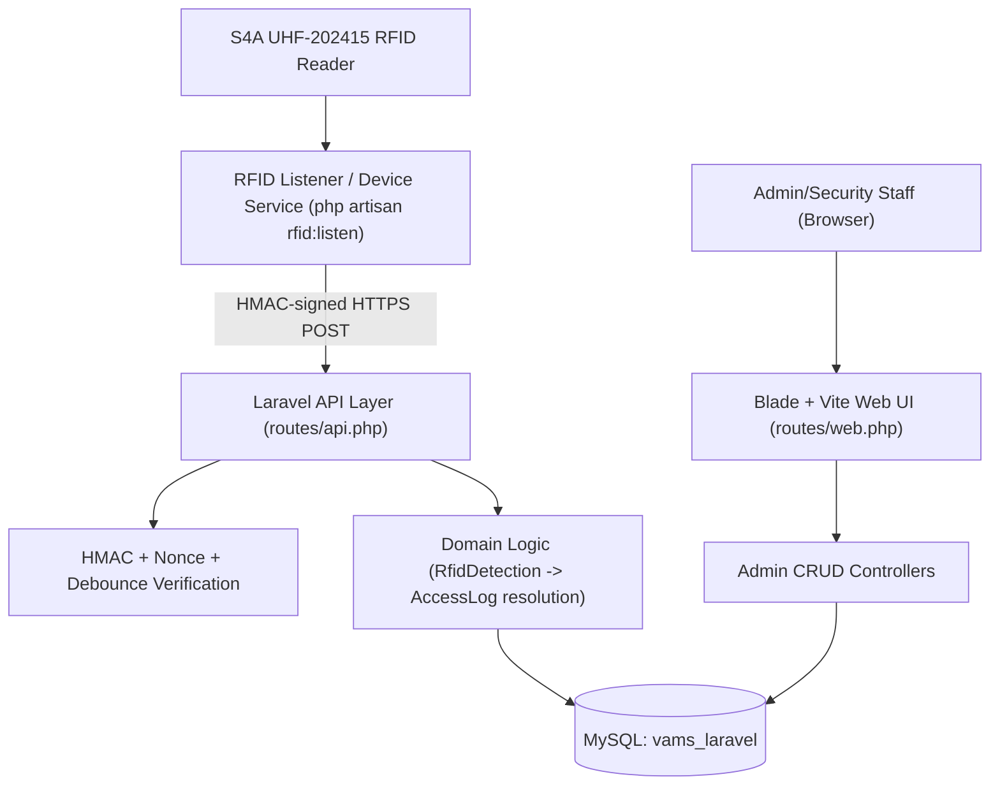
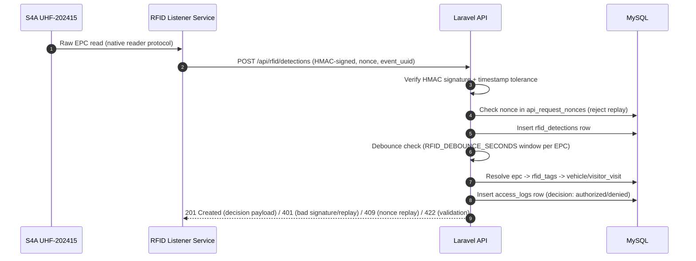
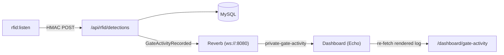

# ARCHITECTURE — System Architecture

> **Purpose:** Describe the high-level architecture, module boundaries, data flows, client/server structure, and cross-cutting concerns so developer decisions align with system integrity.

_Last updated: 2026-09-08 (RFID ingestion API completed)_

---

## 1. System Overview & High-Level Architecture

VAMS is a Laravel 12 (PHP 8.2) monolithic web application backed by MySQL, paired with the **RFID Listener/Device Service** (`php artisan rfid:listen`, a long-running console process shipped inside the same codebase) that talks directly to an **S4A UHF-202415** UHF RFID reader over its native protocol and relays detections to the Laravel app over HTTP as HMAC-signed, nonce-protected API requests.

### Architecture Diagram



---

## 2. Layered Architecture & Conventions

Standard Laravel layered MVC, no additional hexagonal/clean-architecture wrapping is in place:

- **Presentation / View Layer:** Blade templates (`vams-webapp/resources/views/`) + Vite/Tailwind assets for the admin web UI. HTTP Controllers for both web and API routes.
- **Application / Domain Layer:** Eloquent models in `vams-webapp/app/Models/` hold relationships and domain helper methods directly (fat-model pattern). Dedicated service classes now exist for the RFID domain under `app/Services/Rfid/`: `HmacSignatureVerifier` (sign/verify HMAC-SHA256 signatures) and `RfidAccessResolver` (EPC → access decision + vehicle/visit state resolution), both constructor-injected into their consumers per the Dependency Inversion guidance in `context/RULES.md` §4.
- **Infrastructure / Data Access Layer:** Eloquent ORM directly against MySQL; no repository abstraction layer in use.

---

## 3. Directory & Domain Structure

```
vams-webapp/
├── app/
│   ├── Models/        # 16 Eloquent models (User + 15 domain models) — DONE
│   ├── Http/
│   │   ├── Controllers/   # DashboardController, EmployeeController, VehicleController, VisitorController, VisitorVisitController, RfidTagController, RfidReaderController, RfidAssignmentController, Api\RfidIngestionController — DONE
│   │   ├── Middleware/    # EnsureUserHasRole, EnsureAccountIsActive, VerifyRfidSignature ('rfid.hmac' alias) — DONE
│   │   └── Requests/      # Employee/, Vehicle/, Visitor/, VisitorVisit/, RfidTag/, RfidReader/, RfidAssignment/, Rfid/StoreRfidDetectionRequest Form Request classes — DONE
│   ├── Services/
│   │   └── Rfid/          # HmacSignatureVerifier (sign/verify), RfidAccessResolver (EPC -> access decision + vehicle state) — DONE
│   └── Providers/         # AppServiceProvider: Gate::before RBAC hook, Vite config — DONE
├── database/
│   ├── migrations/     # 19 migrations (3 stock + 16 custom) — DONE, see context/SCHEMA.md
│   ├── factories/      # UserFactory, EmployeeFactory, VehicleFactory, VisitorFactory, VisitorVisitFactory, RfidTagFactory, RfidReaderFactory, RfidAssignmentFactory — DONE
│   └── seeders/        # PermissionSeeder, RoleSeeder, DatabaseSeeder — DONE
├── resources/
│   └── views/          # layouts/{app,guest}, auth/login, errors/403, dashboard, employees/*, vehicles/*, visitors/*, visitor-visits/*, rfid-tags/*, rfid-readers/*, rfid-assignments/* — DONE
├── routes/
│   ├── web.php          # auth, dashboard, employees/vehicles/visitors/visitor-visits/rfid-tags/rfid-readers/rfid-assignments resources — DONE
│   └── api.php          # POST /api/rfid/detections behind 'rfid.hmac' middleware — DONE
└── tests/                # PHPUnit Unit/Feature: RbacTest, EmployeeCrudTest, VehicleCrudTest, VisitorCrudTest, RfidTagCrudTest, RfidReaderCrudTest, RfidAssignmentCrudTest — DONE (55 tests passing)
```

---

## 4. Middleware & Request Pipeline

RBAC middleware is implemented; the RFID ingestion API middleware is still planned. Current/planned pipeline:

- **Web (admin) requests:** Laravel session auth (`auth` middleware) → `account.active` middleware (force-logout if `users.status` becomes `suspended` or `locked_until` is in the future mid-session) → route-level `role:slug1,slug2` middleware (`App\Http\Middleware\EnsureUserHasRole`) and/or `can:resource.action` middleware (resolved against `role_permissions` via a `Gate::before` hook in `AppServiceProvider`, backed by `User::hasPermission()`) → Form Request validation → Controller → Blade response.
- **API (RFID device) requests:** HMAC signature verification middleware (validates against `rfid_readers.api_secret_hash`, checks `RFID_HMAC_TOLERANCE_SECONDS`) → nonce replay-check middleware (against `api_request_nonces`, `RFID_NONCE_TTL_SECONDS`) → Form Request validation → Controller → debounce check (`RFID_DEBOUNCE_SECONDS`) → JSON response.

---

## 5. Client-Side Architecture

- **View Layer:** Server-rendered Blade templates. No SPA framework (React/Vue) currently wired in; `package.json` only lists Vite + TailwindCSS + axios as devDependencies.
- **State Management:** N/A (server-rendered). If a richer admin UI interaction layer becomes necessary later, [PLACEHOLDER: decide on Alpine.js/Livewire vs. a full SPA — not yet decided].
- **Routing Strategy:** Laravel's file-based `routes/web.php` / `routes/api.php` route definitions (not file-system routing).

---

## 6. Data Layer & Database Strategy

- **ORM:** Eloquent (Laravel's native ORM). No Prisma/Drizzle/TypeORM — this is a pure PHP/Laravel stack.
- **Database:** MySQL, database `vams_laravel`. See `context/SCHEMA.md` for the full 18-migration, 24-table schema (roles/permissions RBAC, employees, visitors, vehicles, RFID tags/readers/detections/assignments, visitor visits, access/audit/system logs, system settings, API request nonces).
- **Caching:** Database-backed cache (`CACHE_STORE=database`); Redis config exists in `.env` but is unused so far.
- **Connection Management:** Default single-connection Eloquent setup; no read-replica or connection-pooling configuration in place (not needed at this project's scale).

---

## 7. Authentication & Authorization Flow

- **Auth Provider:** Laravel's built-in session-based authentication (no third-party OAuth/Clerk/Supabase Auth).
- **Session Model:** Server-side sessions via the `sessions` database table (`SESSION_DRIVER=database`).
- **Authorization Model:** Role-Based Access Control (RBAC) via `roles` → `role_permissions` → `permissions`, referenced from `users.role_id`. Implemented: `database/seeders/{PermissionSeeder,RoleSeeder}.php` seed 34 `resource.action` permission slugs across 3 roles (Administrator, Security Officer, Encoder/Registrar — see `context/SCHEMA.md` §4 for the exact matrix); `App\Http\Middleware\EnsureUserHasRole` (`role:` middleware) and a `Gate::before` hook in `AppServiceProvider` (backs `can:` middleware, `$user->can()`, `@can`, `$this->authorize()`) enforce it. `EmployeeController`/`VehicleController` implement Laravel 12's `HasMiddleware` interface and gate each action via `can:{resource}.{view,create,update,delete}` middleware rather than per-model Policy classes — this keeps controllers self-describing about their own authorization requirements without needing a matching `Policy` class per model. The same pattern will be reused for the remaining Visitors/RFID Tags/Assignments/Readers controllers.
- **Account lockout:** `users.failed_login_attempts` (increments on failed login) and `users.locked_until` (lockout expiry timestamp) drive brute-force protection in `LoginRequest::authenticate()`; `App\Http\Middleware\EnsureAccountIsActive` (`account.active` middleware) additionally force-logs-out a user mid-session if an admin suspends the account or it becomes locked. Fully implemented and tested (`tests/Feature/RbacTest.php`).
- **RFID device authentication (separate from user auth):** Each `rfid_readers` row carries its own `api_key` + `api_secret_hash` (an *encrypted*, reversible value — see `context/RULES.md` §5) used for HMAC request signing by the external Windows Listener/Device Service — this is a machine-to-machine credential, entirely separate from the `users` table. Verified by `App\Http\Middleware\VerifyRfidSignature` (`rfid.hmac` middleware alias) on every `routes/api.php` request.

---

## 8. Key Data Flows & Sequence Diagrams

### RFID Detection → Access Decision (implemented)



Implemented by `App\Http\Middleware\VerifyRfidSignature` (auth/nonce steps) + `App\Http\Controllers\Api\RfidIngestionController` (detection/debounce/access-log steps, all inside one `DB::transaction`) + `App\Services\Rfid\RfidAccessResolver` (EPC → decision resolution). See `tests/Feature/RfidIngestionApiTest.php`.

### RFID Listener / Device Service

The device side of that flow is `php artisan rfid:listen` — a long-running console command, not a web request. It is a *separate process* from the web server but deliberately *not* a separate codebase:

- **Stack decision (resolved):** PHP 8.2 / Laravel console command. The two stacks the vendor SDK favours (C#/.NET, Python) are not installed on the deployment PC, and neither is required: `stream_socket_client()` covers the TCP link and `Illuminate\Support\Facades\Http` covers the API call. Keeping it in-repo means one runtime, one `.env`, one test suite, and reuse of `HmacSignatureVerifier` on both sides of the signature.
- **It still crosses the HTTP boundary.** The listener holds the reader's plaintext `api_key`/`api_secret` (from `.env`) and POSTs signed detections to `/api/rfid/detections` exactly as an external device would. It never touches the database directly, so the reader path gets no privilege the API contract does not grant it.

| Class | Responsibility |
|-------|----------------|
| `App\Services\Rfid\MmProtocolCodec` | Frame/checksum rules of the vendor "MM" binary protocol; builds the inventory command, extracts frames from a rolling buffer, decodes tag reports (ANT/PC/EPC/RSSI). Pure, no I/O. |
| `App\Services\Rfid\ReaderTransport` | The TCP link, in either direction — `client` mode dials the reader, `server` mode waits for the reader to dial in (the reader's WiFi module supports both). |
| `App\Services\Rfid\DetectionForwarder` | Signs and POSTs one detection. Signs and sends the *same* raw JSON string, since the server verifies against the raw body. |
| `App\Console\Commands\RfidListenCommand` | The loop: connect, poll, decode, locally suppress repeat reads, forward, reconnect with backoff. |
| `App\Console\Commands\RfidDoctorCommand` | Read-only diagnostics across the whole path (network → protocol → API → credentials). |

### Real-time push (Laravel Reverb)

The dashboard is pushed to over WebSockets the instant a tag is read, rather than waiting for a poll — the manuscript (§2.1) names "lack of real-time monitoring" as one of the paper logbook's failings, so this is a claim the system should be able to make literally.



Design decisions worth keeping:

- **`ShouldBroadcastNow`, not `ShouldBroadcast`.** The queue runs on the `database` driver, so a queued broadcast would sit until a worker picked it up — seconds of latency, which defeats the purpose. Broadcasting inline costs the ingestion request one local HTTP call to Reverb.
- **Broadcast failure is swallowed.** `RfidIngestionController::announce()` wraps the dispatch in try/catch and logs a warning. Reverb is a separate process that may well be stopped; **a gate detection must never fail to be recorded because a nicety is down.** Covered by a test that binds a throwing broadcaster and asserts the detection still lands.
- **The broadcast is a nudge, not the data.** The payload carries a small summary, but the dashboard reacts by re-fetching the rendered log from `/dashboard/gate-activity`. That keeps one rendering path (Blade) instead of duplicating row markup in JavaScript, and means a socket that dropped and reconnected still converges on correct state.
- **Polling remains, as a safety net.** The dashboard polls every 2s when no socket is connected and every 30s once one is, flipping back automatically if the connection drops. The page is never dependent on Reverb being up.
- **The channel is private and permission-gated.** `routes/channels.php` authorizes `gate-activity` on `isActive() && can('dashboard.view')` — a WebSocket is another way into the data, so it gets the same authorization as the HTTP route. Note that suspended beats administrator: the active check comes first.

**Enrolling a tag from the browser.** `GET /rfid-tags/recent-scans` (`RfidTagController@recentScans`, gated by `rfid_tags.create`) backs the "Scan a tag" picker on the RFID tag form, so staff pick an EPC the reader just saw instead of reading it off a terminal and retyping it. It deliberately **queries `rfid_detections` rather than the reader**: the listener already POSTs every read, unregistered EPCs included (they are recorded and denied as `unknown_credential`), so the recent reads are already in the database. That keeps the "only the listener talks to the reader" boundary intact and avoids competing with the listener for the reader's single TCP socket. The endpoint returns one entry per EPC from the last 120 seconds, newest read winning, each flagged with its `tag_code` if already registered.

**Two debounce windows, deliberately.** `RFID_LISTENER_DEBOUNCE_SECONDS` suppresses repeat reads *at the device*, so a tag sitting in the antenna field does not flood the API and the `api_request_nonces` table; `RFID_DEBOUNCE_SECONDS` remains the authoritative server-side duplicate flag. Keep the listener window `>=` the server window. **[PLACEHOLDER: for a real gate, the listener window should comfortably exceed how long a vehicle lingers in the read zone — otherwise a stationary vehicle can be toggled `entry` → `exit`. Not yet tuned against real traffic.]**

---

## 9. Domain Logic Highlights

- **Credential lifecycle distinction:** `rfid_tags.credential_type` distinguishes permanent `sticker` credentials (assigned once to a vehicle for its lifetime, via `rfid_assignments.vehicle_id`) from temporary reusable `card` credentials (assigned per visitor visit, via `rfid_assignments.visitor_visit_id`, and released/returned at `rfid_assignments.released_at`).
- **Vehicle state machine (implemented in `RfidAccessResolver`):** `vehicles.current_state` (`outside` ↔ `inside`) toggles on every *authorized* `access_logs` entry: a vehicle currently `outside` scanning in produces `direction=entry` and flips it to `inside`; a vehicle currently `inside` produces `direction=exit` and flips it back to `outside`. On-foot visitor cards with no linked vehicle instead toggle direction off that visit's own last authorized `access_logs.direction` (defaulting to `entry` if none exists yet), and do not touch any `vehicles` row. Denied detections never change any state. Missed-exit-scan drift (a vehicle stuck `inside` because its exit read was never captured) is not auto-corrected — an administrator would need to manually adjust `vehicles.current_state` — **[PLACEHOLDER: no admin "force state" action built yet]**.
- **Detection deduplication:** `rfid_detections.is_duplicate` is set by the debounce filter (`RFID_DEBOUNCE_SECONDS`, default 5s window per EPC) so repeated reads of a stationary tag near the reader do not each generate a new `access_logs` entry — duplicates are recorded in `rfid_detections` for audit purposes but skip the access-decision + `access_logs` step entirely.
- **Access denial reasons (`access_logs.denial_reason`):** `unknown_credential` (EPC not in `rfid_tags`), `credential_inactive`/`credential_expired` (tag status/expiry), `unassigned_credential` (tag has no active `rfid_assignments` row), `vehicle_inactive` (assigned vehicle soft-deleted or `status != active`), `visit_not_active`/`visit_expired` (assigned visitor_visit not `active` or past `valid_until`).

---

## 10. Cross-Cutting Concerns

- **Error Handling:** RFID ingestion API responds with a JSON envelope: `{"message": "..."}` for 401 (auth failure)/409 (replayed nonce)/422 (validation) errors, and `{"event_uuid", "is_duplicate", "decision", "denial_reason", "direction"}` for the 201 success case (`RfidIngestionController::store()`). No custom formatting for the web/Blade routes beyond Laravel's default exception handler.
- **Input Validation:** Laravel Form Request classes at every controller boundary (see `context/RULES.md` §5).
- **Security:** HMAC signing + nonce replay protection + debounce for the RFID API (see `context/RULES.md` §5); Laravel's built-in CSRF protection for web routes; parameterized queries via Eloquent (no raw SQL string concatenation).
- **Observability & Logging:** Laravel Pail for local log tailing (`composer dev` script); `system_logs` table for structured operational logging; `audit_logs` table for human-driven admin actions, written via the `AuditLog::record(string $action, Model $subject, ?Request $request, array $details = [])` static helper (used by `EmployeeController`/`VehicleController` on create/update/delete, e.g. `employee.created`, `vehicle.deleted`); no external APM/Sentry integration configured yet.
- **Performance Budgets:** [PLACEHOLDER: no formal latency/throughput targets defined yet for the RFID ingestion endpoint — should be set once the physical reader's expected read rate is known.]
