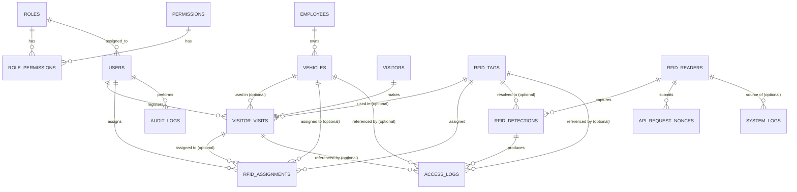

# SCHEMA — Database & API Schema

> **Purpose:** Document the database structure, table definitions, relationships, security policies, and API contracts so developers and AI agents query and manipulate data safely without guessing schema details.

_Last updated: 2026-09-11_

---

## 1. Data Layer Overview

- **Primary Database:** MySQL (via XAMPP), database name `vams_laravel` (dedicated to this Laravel app; kept separate from the pre-existing legacy `vams` database on the same MySQL instance, which holds an unrelated ESP32/fingerprint schema — do not touch `vams`).
- **Cache Datastore:** Database-backed cache (`CACHE_STORE=database` in `.env`). No Redis in active use yet, though config exists.
- **Sessions/Queue:** Database driver (`SESSION_DRIVER=database`, `QUEUE_CONNECTION=database`).
- **Object Storage:** Local filesystem (`FILESYSTEM_DISK=local`). No S3 in use.
- **Migration source of truth:** `vams-webapp/database/migrations/`. This file mirrors the 22 migration files (3 stock Laravel + 19 custom) as of the last-updated date above. The historical `2026_09_11_210340_create_password_reset_tokens_table` migration is intentionally a no-op because Laravel's base users migration owns that table. If this document and the migrations diverge, the migrations win — update this file to match.

---

## 2. Database Tables & ER Diagram



---

## 3. Table Schemas & Column Definitions

### Table: `users` (built-in, extended)

| Column | Type | Nullable | Default | Notes |
| :-- | :-- | :-- | :-- | :-- |
| `id` | bigint | No | auto-increment | PK |
| `name` | string | No | — | |
| `email` | string | No | — | unique |
| `email_verified_at` | timestamp | Yes | — | |
| `password` | string | No | — | hashed |
| `remember_token` | string | Yes | — | |
| `role_id` | FK → `roles.id` | Yes | — | `nullOnDelete` |
| `status` | string | No | `'active'` | `active`, `suspended` |
| `last_login_at` | timestamp | Yes | — | |
| `last_login_ip` | string(45) | Yes | — | |
| `failed_login_attempts` | unsigned int | No | `0` | used for lockout logic |
| `locked_until` | timestamp | Yes | — | account lockout expiry |
| `created_at`, `updated_at` | timestamps | — | — | |

### Table: `roles`

| Column | Type | Nullable | Default | Notes |
| :-- | :-- | :-- | :-- | :-- |
| `id` | bigint | No | auto-increment | PK |
| `name` | string | No | — | unique |
| `slug` | string | No | — | unique |
| `description` | string | Yes | — | |
| `created_at`, `updated_at` | timestamps | — | — | |

### Table: `permissions`

| Column | Type | Nullable | Default | Notes |
| :-- | :-- | :-- | :-- | :-- |
| `id` | bigint | No | auto-increment | PK |
| `name` | string | No | — | unique |
| `slug` | string | No | — | unique |
| `description` | string | Yes | — | |
| `created_at`, `updated_at` | timestamps | — | — | |

### Table: `role_permissions` (pivot)

| Column | Type | Nullable | Default | Notes |
| :-- | :-- | :-- | :-- | :-- |
| `id` | bigint | No | auto-increment | PK |
| `role_id` | FK → `roles.id` | No | — | `cascadeOnDelete` |
| `permission_id` | FK → `permissions.id` | No | — | `cascadeOnDelete` |
| `created_at`, `updated_at` | timestamps | — | — | |
| Unique | — | — | — | `(role_id, permission_id)` |

### Table: `employees`

| Column | Type | Nullable | Default | Notes |
| :-- | :-- | :-- | :-- | :-- |
| `id` | bigint | No | auto-increment | PK |
| `employee_code` | string | No | — | unique |
| `first_name` | string | No | — | |
| `last_name` | string | No | — | |
| `department` | string | Yes | — | |
| `position` | string | Yes | — | |
| `contact_number` | string(30) | Yes | — | |
| `email` | string | Yes | — | |
| `status` | string | No | `'active'` | `active`, `inactive` |
| `created_at`, `updated_at`, `deleted_at` | timestamps/soft-delete | — | — | |

### Table: `visitors`

| Column | Type | Nullable | Default | Notes |
| :-- | :-- | :-- | :-- | :-- |
| `id` | bigint | No | auto-increment | PK |
| `first_name` | string | No | — | |
| `last_name` | string | No | — | |
| `contact_number` | string(30) | Yes | — | |
| `valid_id_type` | string | Yes | — | |
| `valid_id_number` | string | Yes | — | |
| `address` | string | Yes | — | |
| `created_at`, `updated_at`, `deleted_at` | timestamps/soft-delete | — | — | |

### Table: `vehicles`

| Column | Type | Nullable | Default | Notes |
| :-- | :-- | :-- | :-- | :-- |
| `id` | bigint | No | auto-increment | PK |
| `plate_number` | string | No | — | unique |
| `vehicle_type` | string | Yes | — | sedan/van/motorcycle/truck/etc. |
| `make` | string | Yes | — | |
| `model` | string | Yes | — | |
| `color` | string | Yes | — | |
| `owner_type` | enum | No | `'employee'` | `employee`, `visitor` |
| `employee_id` | FK → `employees.id` | Yes | — | `nullOnDelete` |
| `status` | string | No | `'active'` | `active`, `inactive` |
| `current_state` | enum | No | `'outside'` | `outside`, `inside` — updated per processed access event |
| `last_seen_at` | timestamp | Yes | — | |
| `created_at`, `updated_at`, `deleted_at` | timestamps/soft-delete | — | — | |

### Table: `rfid_tags`

| Column | Type | Nullable | Default | Notes |
| :-- | :-- | :-- | :-- | :-- |
| `id` | bigint | No | auto-increment | PK |
| `epc` | string | No | — | unique; Electronic Product Code from credential |
| `credential_type` | enum | No | `'card'` | `sticker` (permanent, vehicle windshield) or `card` (temporary, reusable visitor PVC card) |
| `status` | enum | No | `'active'` | `active`, `inactive`, `lost`, `disabled`, `expired` |
| `issued_at` | timestamp | Yes | — | |
| `expires_at` | timestamp | Yes | — | |
| `notes` | text | Yes | — | |
| `created_at`, `updated_at` | timestamps | — | — | |

### Table: `visitor_visits`

| Column | Type | Nullable | Default | Notes |
| :-- | :-- | :-- | :-- | :-- |
| `id` | bigint | No | auto-increment | PK |
| `visitor_id` | FK → `visitors.id` | No | — | `cascadeOnDelete` |
| `vehicle_id` | FK → `vehicles.id` | Yes | — | `nullOnDelete` |
| `rfid_tag_id` | FK → `rfid_tags.id` | Yes | — | `nullOnDelete` |
| `purpose` | string | Yes | — | |
| `host_name` | string | Yes | — | employee/department being visited |
| `valid_from` | dateTime | No | — | |
| `valid_until` | dateTime | No | — | |
| `status` | enum | No | `'active'` | `active`, `checked_out`, `expired`, `cancelled` |
| `checked_out_at` | timestamp | Yes | — | |
| `registered_by` | FK → `users.id` | Yes | — | `nullOnDelete` |
| `created_at`, `updated_at` | timestamps | — | — | |

### Table: `rfid_assignments`

| Column | Type | Nullable | Default | Notes |
| :-- | :-- | :-- | :-- | :-- |
| `id` | bigint | No | auto-increment | PK |
| `rfid_tag_id` | FK → `rfid_tags.id` | No | — | `cascadeOnDelete` |
| `vehicle_id` | FK → `vehicles.id` | Yes | — | `nullOnDelete`; set when tag is a sticker |
| `visitor_visit_id` | FK → `visitor_visits.id` | Yes | — | `nullOnDelete`; set when tag is a card |
| `assigned_at` | dateTime | No | — | |
| `released_at` | dateTime | Yes | — | |
| `assigned_by` | FK → `users.id` | Yes | — | `nullOnDelete` |
| `created_at`, `updated_at` | timestamps | — | — | |

### Table: `rfid_readers`

| Column | Type | Nullable | Default | Notes |
| :-- | :-- | :-- | :-- | :-- |
| `id` | bigint | No | auto-increment | PK |
| `device_name` | string | No | — | e.g. "Main Gate Reader" |
| `device_code` | string | No | — | unique, internal identifier |
| `model` | string | No | `'S4A UHF-202415'` | |
| `location` | string | Yes | — | |
| `ip_address` | string(45) | Yes | — | |
| `api_key` | string | No | — | unique; used by the Windows RFID Listener/Device Service to authenticate |
| `api_secret_hash` | text | No | — | **Encrypted** (`Crypt::encryptString()`, AES-256 via `APP_KEY`) device secret — despite the column name, this is *not* a bcrypt hash. Widened from `VARCHAR(255)` to `TEXT` (see `2026_09_08_042928_widen_api_secret_hash_column_on_rfid_readers_table`) because ciphertext runs ~300+ chars. Reversible so the RFID ingestion API can recompute an HMAC signature from it; see `context/RULES.md` §5. |
| `status` | enum | No | `'offline'` | `online`, `offline`, `disabled` |
| `last_heartbeat_at` | timestamp | Yes | — | |
| `created_at`, `updated_at` | timestamps | — | — | |

### Table: `rfid_detections`

| Column | Type | Nullable | Default | Notes |
| :-- | :-- | :-- | :-- | :-- |
| `id` | bigint | No | auto-increment | PK |
| `event_uuid` | uuid | No | — | unique; generated by device service for idempotency |
| `rfid_reader_id` | FK → `rfid_readers.id` | No | — | `cascadeOnDelete` |
| `epc` | string | No | — | raw EPC read |
| `rfid_tag_id` | FK → `rfid_tags.id` | Yes | — | `nullOnDelete`; resolved match, if any |
| `rssi` | integer | Yes | — | signal strength |
| `antenna` | string | Yes | — | |
| `detected_at` | dateTime | No | — | timestamp reported by device service |
| `received_at` | dateTime | No | — | timestamp recorded by server |
| `is_duplicate` | boolean | No | `false` | flagged by debounce filter |
| `created_at`, `updated_at` | timestamps | — | — | |
| Index | — | — | — | `(epc, detected_at)` |

### Table: `access_logs`

| Column | Type | Nullable | Default | Notes |
| :-- | :-- | :-- | :-- | :-- |
| `id` | bigint | No | auto-increment | PK |
| `rfid_detection_id` | FK → `rfid_detections.id` | Yes | — | `nullOnDelete` |
| `rfid_tag_id` | FK → `rfid_tags.id` | Yes | — | `nullOnDelete` |
| `vehicle_id` | FK → `vehicles.id` | Yes | — | `nullOnDelete` |
| `visitor_visit_id` | FK → `visitor_visits.id` | Yes | — | `nullOnDelete` |
| `direction` | enum | Yes | — | `entry`, `exit` |
| `decision` | enum | No | `'denied'` | `authorized`, `denied` |
| `denial_reason` | string | Yes | — | e.g. `unknown_credential`, `inactive`, `expired`, `no_vehicle` |
| `occurred_at` | dateTime | No | — | |
| `created_at`, `updated_at` | timestamps | — | — | |
| Index | — | — | — | `(decision, occurred_at)` |

### Table: `audit_logs`

| Column | Type | Nullable | Default | Notes |
| :-- | :-- | :-- | :-- | :-- |
| `id` | bigint | No | auto-increment | PK |
| `user_id` | FK → `users.id` | Yes | — | `nullOnDelete` |
| `action` | string | No | — | e.g. `employee.created`, `rfid_tag.deactivated` |
| `subject_type` | string | Yes | — | polymorphic |
| `subject_id` | unsigned bigint | Yes | — | polymorphic |
| `details` | json | Yes | — | |
| `ip_address` | string(45) | Yes | — | |
| `user_agent` | string | Yes | — | |
| `created_at`, `updated_at` | timestamps | — | — | |
| Index | — | — | — | `(subject_type, subject_id)` |

### Table: `system_logs`

| Column | Type | Nullable | Default | Notes |
| :-- | :-- | :-- | :-- | :-- |
| `id` | bigint | No | auto-increment | PK |
| `level` | enum | No | `'info'` | `debug`, `info`, `warning`, `error`, `critical` |
| `source` | string | Yes | — | e.g. `rfid_reader`, `api`, `auth`, `rate_limiter` |
| `rfid_reader_id` | FK → `rfid_readers.id` | Yes | — | `nullOnDelete` |
| `message` | string | No | — | |
| `context` | json | Yes | — | |
| `created_at`, `updated_at` | timestamps | — | — | |
| Index | — | — | — | `(level, created_at)` |

### Table: `system_settings`

| Column | Type | Nullable | Default | Notes |
| :-- | :-- | :-- | :-- | :-- |
| `id` | bigint | No | auto-increment | PK |
| `key` | string | No | — | unique |
| `value` | text | Yes | — | |
| `description` | string | Yes | — | |
| `created_at`, `updated_at` | timestamps | — | — | |

### Table: `api_request_nonces`

| Column | Type | Nullable | Default | Notes |
| :-- | :-- | :-- | :-- | :-- |
| `id` | bigint | No | auto-increment | PK |
| `rfid_reader_id` | FK → `rfid_readers.id` | No | — | `cascadeOnDelete` |
| `nonce` | string | No | — | |
| `expires_at` | dateTime | No | — | |
| `created_at`, `updated_at` | timestamps | — | — | |
| Unique | — | — | — | `(rfid_reader_id, nonce)` — replay protection |

---

## 4. Row-Level Security (RLS) & Access Policies

No database-level RLS (MySQL doesn't support it natively). Access control is enforced at the application layer:

- **RBAC via `roles`/`permissions`/`role_permissions`:** Three seeded roles (`database/seeders/RoleSeeder.php`), permissions seeded as `resource.action` slugs (`database/seeders/PermissionSeeder.php`, e.g. `employees.create`, `access_logs.view`):
  - **Administrator** (`administrator`) — every permission (34/34), including `users.*` and `system_settings.*`.
  - **Security Officer** (`security-officer`) — read-only: `dashboard.view`, `access_logs.view`, `employees.view`, `visitors.view`, `vehicles.view`, `rfid_tags.view`, `rfid_readers.view`.
  - **Encoder/Registrar** (`encoder-registrar`) — view/create/update on `employees`, `visitors`, `visitor_visits`, `vehicles`, `rfid_tags`, `rfid_assignments`, `rfid_readers`, plus `dashboard.view`; **no `.delete` on any resource** (deletion is Administrator-only) and no `users.*` or `system_settings.*`.
  - Enforcement: `App\Http\Middleware\EnsureUserHasRole` (`role:slug1,slug2` route middleware, role-slug based) and a `Gate::before` hook in `AppServiceProvider` that authorizes any ability name matching a seeded permission slug via `User::hasPermission()` (used by `can:resource.action` middleware, `$user->can()`, `@can`, `$this->authorize()`). `App\Http\Middleware\EnsureAccountIsActive` (`account.active` middleware, applied to the authenticated route group) force-logs-out a user whose account is suspended or locked mid-session.
- **RFID device authentication:** `rfid_readers.api_key` + `api_secret_hash` (HMAC signing) gate all device-service API writes. See `RFID_HMAC_TOLERANCE_SECONDS`, `RFID_NONCE_TTL_SECONDS`, `RFID_DEBOUNCE_SECONDS` in `.env`.

---

## 5. API Routes by Domain

Implemented so far in `vams-webapp/routes/web.php` (all under the `['auth', 'account.active']` middleware group unless noted):

- **Auth:** `GET/POST /login` (guest-only), `POST /logout`.
- **Dashboard:** `GET /dashboard` (`DashboardController@index`).
- **Admin CRUD — Employees:** `Route::resource('employees', EmployeeController::class)` (7 REST routes: index/create/store/show/edit/update/destroy). Per-action `can:employees.{view,create,update,delete}` middleware via `EmployeeController::middleware()` (`HasMiddleware` interface).
- **Admin CRUD — Vehicles:** `Route::resource('vehicles', VehicleController::class)`, same pattern, `can:vehicles.{view,create,update,delete}`.
- **Admin CRUD — Visitors:** `Route::resource('visitors', VisitorController::class)`, same pattern, `can:visitors.{view,create,update,delete}`. Covers only the `visitors` record (personal/ID info); see `visitor_visits` below for the check-in/check-out workflow.
- **Admin CRUD — Visitor Visits:** `Route::resource('visitor-visits', VisitorVisitController::class)` plus `POST visitor-visits/{visitor_visit}/check-out` (`can:visitor_visits.update`), gated by a dedicated `visitor_visits` permission group (`view`/`create`/`update`/`delete`). `store` (check-in) creates the `visitor_visits` row and, if an RFID card is selected, atomically creates the linked `rfid_assignments` row in the same `DB::transaction` (the create form only lists active, unassigned `credential_type=card` tags; `StoreVisitorVisitRequest` re-validates server-side that the chosen card has no active assignment, mirroring `StoreRfidAssignmentRequest`'s check). `checkOut()` sets `status=checked_out`/`checked_out_at` and releases the linked `rfid_assignments` row (`released_at`) in the same transaction. `edit`/`update` are scoped to correctable fields only (`vehicle_id`, `purpose`, `host_name`, `valid_from`, `valid_until`) — the `visitor_id`/`rfid_tag_id` pairing is immutable post-check-in (check out then check in again instead), mirroring the `rfid_assignments` immutable-history precedent.
- **Admin CRUD — RFID Tags:** `Route::resource('rfid-tags', RfidTagController::class)`, same pattern, `can:rfid_tags.{view,create,update,delete}`. Manages `rfid_tags` records (EPC, credential_type, status, issued/expires dates); show view lists assignment history via the `assignments` relationship.
- **Admin CRUD — RFID Readers:** `Route::resource('rfid-readers', RfidReaderController::class)` plus `POST rfid-readers/{rfid_reader}/regenerate-credentials` (`can:rfid_readers.update`). Device API credentials (`api_key`/`api_secret_hash`) are generated server-side with `Str::random()` + `Crypt::encryptString()` — never accepted from client input — and the plaintext secret is flashed to the session once (`plain_api_secret`) immediately after create/regenerate, then never logged in plaintext (only the encrypted ciphertext is persisted; it is reversible via `Crypt::decryptString()` so the RFID ingestion API can recompute the HMAC signature — a one-way hash would not support that).
- **Admin CRUD — RFID Assignments:** `Route::resource('rfid-assignments', RfidAssignmentController::class)` plus `POST rfid-assignments/{rfid_assignment}/release` (`can:rfid_assignments.update`). Links an `rfid_tags` row to exactly one of `vehicle_id` (sticker) or `visitor_visit_id` (card) via `prohibits`/`required_without` validation rules; rejects creating a new assignment for a tag that already has an active (`released_at IS NULL`) assignment. `assigned_by` is set server-side from the authenticated user. `edit`/`update` only allow correcting the `assigned_at` timestamp — the tag/target pairing and release are immutable via update (use release + a new assignment instead) to preserve accurate history.

- **RFID Ingestion API:** `POST /api/rfid/detections` (`routes/api.php`, `Api\RfidIngestionController@store`), behind the `rfid.hmac` middleware (`App\Http\Middleware\VerifyRfidSignature`). Authenticates every request via HMAC-SHA256 signature (`App\Services\Rfid\HmacSignatureVerifier`), timestamp tolerance (`RFID_HMAC_TOLERANCE_SECONDS`), and single-use nonce tracked in `api_request_nonces` (`RFID_NONCE_TTL_SECONDS`). Records an `rfid_detections` row per request; flags `is_duplicate` when a prior detection for the same EPC exists within `RFID_DEBOUNCE_SECONDS`. Non-duplicate detections are resolved via `App\Services\Rfid\RfidAccessResolver` (EPC → `rfid_tags` → active `rfid_assignments` → `vehicles`/`visitor_visits`) into an `access_logs` row with `decision` (`authorized`/`denied`), `direction` (`entry`/`exit`), and `denial_reason` where applicable; authorized vehicle-linked detections also toggle `vehicles.current_state`/`last_seen_at`. Rejections (bad/missing signature, stale timestamp, unknown/disabled reader, replayed nonce) are logged to `system_logs` (`source=rfid_ingestion_api`) and never create a `rfid_detections` row. Covered by `tests/Feature/RfidIngestionApiTest.php` (9 tests) and `tests/Unit/HmacSignatureVerifierTest.php` (5 tests).

Planned domains (not yet built — see `context/TASKS.md`):

- **Reporting/Dashboard:** access logs, audit logs, system logs views.

---

## 6. Request & Response Payload Examples

### `POST /api/rfid/detections` (RFID device ingestion API)

**Required headers** (all HMAC/auth, no `Authorization` bearer token in use):

| Header | Description |
| :-- | :-- |
| `X-Rfid-Api-Key` | The reader's `rfid_readers.api_key`. |
| `X-Rfid-Timestamp` | Unix timestamp (seconds) the request was signed at; must be within `RFID_HMAC_TOLERANCE_SECONDS` of server time. |
| `X-Rfid-Nonce` | Request-unique random string (e.g. a UUID); rejected as a replay if reused within `RFID_NONCE_TTL_SECONDS` for the same reader. |
| `X-Rfid-Signature` | Hex `hash_hmac('sha256', "{api_key}.{timestamp}.{nonce}.{raw_json_body}", plaintext_api_secret)`. |

**Request body** (`Content-Type: application/json`):

```json
{
  "event_uuid": "550e8400-e29b-41d4-a716-446655440000",
  "epc": "E2000019760801234567890A",
  "rssi": -42,
  "antenna": "1",
  "detected_at": "2026-09-08 12:34:56"
}
```

**Success response** — `201 Created`:

```json
{
  "event_uuid": "550e8400-e29b-41d4-a716-446655440000",
  "is_duplicate": false,
  "decision": "authorized",
  "denial_reason": null,
  "direction": "entry"
}
```

When `is_duplicate` is `true`, `decision`/`denial_reason`/`direction` are all `null` (the detection was recorded but skipped access-decision processing).

**Error responses:**

- `401 Unauthorized` — `{"message": "..."}` for missing headers, invalid timestamp, stale timestamp, unknown/disabled reader, or invalid signature.
- `409 Conflict` — `{"message": "This request has already been processed (replayed nonce)."}`.
- `422 Unprocessable Content` — standard Laravel Form Request validation error envelope (`message`, `errors`) for a malformed body (e.g. non-UUID `event_uuid`, duplicate `event_uuid`, missing `epc`/`detected_at`).

---

## 7. Phase-Based Route Priority

- **Phase 1 (MVP):** RBAC auth + lockout, RFID ingestion API (HMAC + nonce + debounce) — **done**, core admin CRUD (Employees, Vehicles, RFID Tags).
- **Phase 2 (Enhancement):** Visitor management CRUD + visit lifecycle, RFID assignment workflows, dashboard/reporting views.
- **Phase 3 (Scale):** Windows RFID Listener/Device Service polish, system settings UI, audit log export.

---

## 8. Migrations & Schema Versioning

- **Migration Tooling:** Laravel's native migration system (`php artisan make:migration`, `php artisan migrate`).
- **File Naming Convention:** Laravel default (`YYYY_MM_DD_HHMMSS_description.php`); current custom migrations use a normalized `2025_01_01_0000NN_*` sequence for readability.
- **Execution Strategy:** Additive migrations only; never edit an already-applied migration file directly — the project is pre-launch but `migrate:fresh`/`migrate:reset` still require explicit approval per `context/RULES.md`.
- **Known gotcha:** Use `$table->dateTime(...)` instead of `$table->timestamp(...)` for required datetime columns without a default value — MySQL strict mode rejects the latter with "Invalid default value" (already fixed in `visitor_visits`, `rfid_assignments`, `rfid_detections`, `access_logs`).
